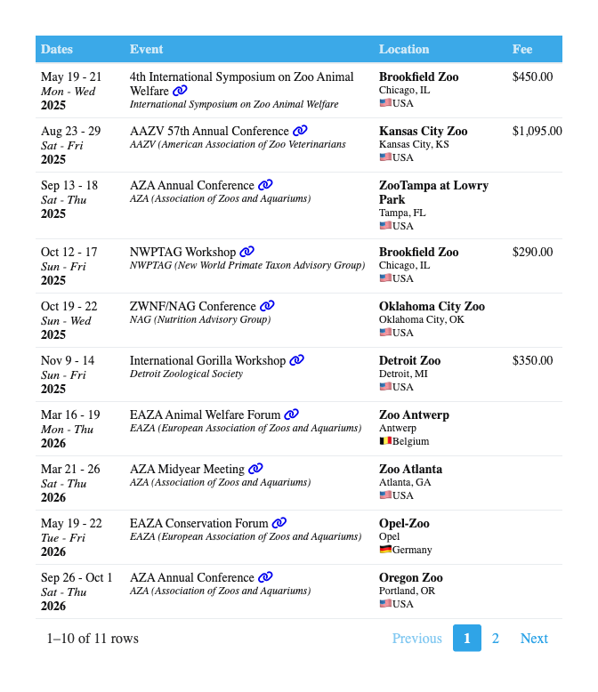

Conferences
================

## Conferences and Workshops

Browse the options from this page if you are interested in attending or
presenting at a workshop or conference. If you plan to present any work
related to the Rich Lab, then you should start discussing this with
Dr. Rich as soon as possible. Some of the options on here are
conferences she attends routinely, while others are simply events of
interest that might be a good fit for our lab’s projects.

You should also keep in mind that FUSE and GRACA awards can cover the
cost of your registration, travel, lodging, etc. Dr. Rich can also help
you research other funding options to make sure the cost is not a
barrier.

### Zoos

``` r
tbl
```

<!-- -->
